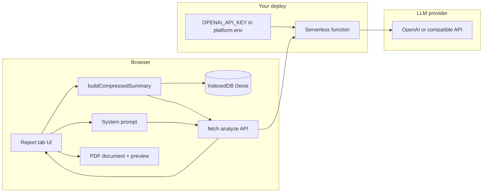

# AI analysis and PDF report

## Context

- **Stack**: Vite + React 19, no router; tabs and `dataRevision` live in [`src/App.tsx`](c:\Users\ryanm\OneDrive\Documents\projects\health-data-dashboard\src\App.tsx). Global date range comes from [`src/time/DateRangeProvider.tsx`](c:\Users\ryanm\OneDrive\Documents\projects\health-data-dashboard\src/time/DateRangeProvider.tsx) via `useDateRange()`.
- **Data**: Dexie tables (`timeseries`, `bloodPressure`, `sleepSessions`, `sportSessions`, `weightMeasurements`) — see [`src/types/canonical.ts`](c:\Users\ryanm\OneDrive\Documents\projects\health-data-dashboard\src/types/canonical.ts). Range queries today mix `db.*.toArray()` + filter in pages (e.g. [`ActivityPage.tsx`](c:\Users\ryanm\OneDrive\Documents\projects\health-data-dashboard\src/pages/ActivityPage.tsx) `loadTs`); the report builder should prefer **indexed `where('timestamp').between(...)`** (and sleep overlap logic similar to [`RecoveryPage.tsx`](c:\Users\ryanm\OneDrive\Documents\projects\health-data-dashboard\src/pages/RecoveryPage.tsx) `loadSleep`) so large imports stay usable.

## Architecture (high level)

## 1. Compressed health payload (“AI bundle”)

Add a dedicated module (e.g. [`src/report/buildCompressedSummary.ts`](c:\Users\ryanm\OneDrive\Documents\projects\health-data-dashboard\src/report/buildCompressedSummary.ts)) that returns a **versioned JSON** structure, not raw rows:

- **Metadata**: selected range (`start`/`end` ISO), generated-at timestamp, app version string, row counts per domain.
- **Blood pressure**: count; min/max/mean systolic & diastolic & pulse; optional **daily aggregates** (one row per day) for trends.
- **Timeseries metrics** (group by `metricType`): count; min/max/mean; for dense metrics (HR, SpO₂, breathing) add coarse percentiles or **hour-of-day** buckets to capture pattern without thousands of points.
- **Sleep**: per-session summaries already small; cap list length with “latest N sessions” + totals if range is huge.
- **Sport / weight**: counts, totals, recent samples as needed.

Reuse existing math where it fits ([`src/metrics/aggregates.ts`](c:\Users\ryanm\OneDrive\Documents\projects\health-data-dashboard\src/metrics/aggregates.ts) `averageBloodPressure`, etc.) and add small pure helpers for percentiles / daily rollups. Keep the serialized object **deterministic** (sorted keys) for easier testing.

Export two artifacts from the same builder:

1. **`compressedJson`** — machine-readable for the model.
2. **`compressedText`** — short markdown or plain-text block for human-readable PDF sections and copy UI.

## 2. System prompt and analysis flow

- **Defaults**: ship a **default system prompt** in code (medical-information assistant tone, **not a substitute for professional care**, encourage seeing a clinician for concerning patterns). Store the **user-editable** system prompt in `localStorage` (same pattern as theme if any, or new key).
- **User message**: concatenate structured instructions + the compressed payload (JSON or text). Optionally add a one-line “focus” field in the UI (e.g. “emphasize cardiovascular trends”).
- **Output**: store the latest analysis in React state; allow **manual edit** so the PDF can use corrected wording without re-calling the model.

## 3. Calling the AI model

**Primary path (production):** a **serverless HTTP function** in this repo that holds `OPENAI_API_KEY` (or compatible provider) in the **hosting platform’s environment variables**. The SPA `POST`s JSON (system prompt + user message containing compressed health data); the function calls the provider and returns assistant text.

**Fallback:** **Copy / export** compressed payload + prompt; user pastes the model reply into the Report tab (offline, no deploy).

| Mode | Behavior |
|------|----------|
| **Serverless (default for deployed app)** | `POST /api/analyze` (name TBD) on the same deployment or a known base URL; no provider key in the browser. |
| **Copy / export** | Same as today for air-gapped or local-only use. |

### Serverless: where environment variables live (you still have no server *to operate*)

A **static SPA** has no runtime on your machine—only files. A **serverless function** is not a long-lived VPS you manage; it is a **small HTTP handler** deployed to a host (Vercel, Netlify, Cloudflare Workers, etc.) that **runs on demand** when a URL is hit.

- **Environment variables** for that function are set in the **hosting platform’s project settings** (or CI secrets), e.g. `OPENAI_API_KEY`. They are **injected at deploy/runtime** into the function process only.
- They **do not** appear in the static JS bundle the browser downloads; the browser calls **your** `/api/...` URL, and the function uses the secret to call the LLM provider.

So: **no server you install and keep running**, but **server-side code** you deploy once; the “environment” is the platform’s config, not your laptop.

### Walkthrough: setting up the serverless function

Pick **one** hosting platform (below uses **Vercel** as the default story; Netlify and Cloudflare are analogous with different folder names and config).

#### 1. Choose platform and project shape

- **Same repo (recommended):** Vite app stays in the repo root; add **one serverless file** at [`api/analyze.ts`](c:\Users\ryanm\OneDrive\Documents\projects\health-data-dashboard\api/analyze.ts) (Vercel Node runtime) or the equivalent for your host.
- **Alternative:** deploy the SPA to static hosting and a **separate** repo for a tiny API only—same handler logic, two deploys. Same-repo is simpler for one person.

#### 2. Implement the handler

- **Method:** `POST` only (reject `GET` with 405).
- **Request body (JSON):** e.g. `{ systemPrompt: string, userMessage: string, model?: string }`. The `userMessage` includes the stringified compressed health summary (built client-side).
- **Server behavior:**
  - Read `process.env.OPENAI_API_KEY` (or `OPENAI_API_KEY` + `OPENAI_BASE_URL` if using a compatible gateway).
  - `fetch` the provider’s chat completions endpoint (OpenAI-compatible shape).
  - Return JSON: `{ content: string }` (assistant message) or `{ error: string }` with appropriate HTTP status.
- **CORS:** For browser calls, the handler must respond to **`OPTIONS`** preflight and set headers such as `Access-Control-Allow-Origin` to your deployed site origin (avoid `*` in production if you can pin the domain). Mirror `Access-Control-Allow-Headers` for `Content-Type`.
- **Errors:** Map provider 4xx/5xx to a safe message to the client (do not leak raw API error bodies that might contain key info).

#### 3. Connect the repo to the host

- Create a Vercel (or Netlify) account → **Import** the Git repository.
- **Build command:** `npm run build` (same as today).
- **Output directory:** `dist` (Vite default).
- **Framework preset:** Vite, or Other with the above settings.

#### 4. Add environment variables in the dashboard

- In the project → **Settings → Environment Variables**:
  - `OPENAI_API_KEY` = your provider secret (Production and Preview as needed).
  - Optional: `OPENAI_MODEL` default, or `OPENAI_BASE_URL` for Azure/OpenRouter-compatible endpoints.
- **Redeploy** after adding or changing vars (most platforms do not apply new env to old deployments).

#### 5. Wire the frontend

- **Production:** same-origin `fetch('/api/analyze', …)` when the SPA and API live on one Vercel project (Vercel serves `/api/*` as functions).
- **If API is on another origin:** set `VITE_ANALYZE_API_URL` at build time to `https://your-api.vercel.app/api/analyze` (or use runtime config JSON—only if you need a single build for multiple backends).
- **Never** put the provider API key in `VITE_*` env vars (those are inlined into the client bundle).

#### 6. Local development

- **`vercel dev`** (from [Vercel CLI](https://vercel.com/docs/cli)): runs the Vite app and the `/api` routes together locally; uses your linked project’s env or a local `.env` for the function (document in README; do not commit `.env`).
- **If you only run `npm run dev`:** the `/api` route **won’t exist** unless you add a **Vite dev proxy** in `vite.config.ts` that forwards `/api` to `vercel dev` on another port, or you mock the analyze call in dev. Prefer one command (`vercel dev`) for full-stack local testing.

#### 7. Abuse and rate limits (minimal first version)

- **Optional v1:** add a shared secret header (e.g. `X-App-Secret` from env `ANALYZE_SHARED_SECRET`) that the SPA must send—stored in the app as `VITE_ANALYZE_SHARED_SECRET` (weak against anyone who inspects the bundle, but blocks casual scraping). **Stronger** protection later: auth (e.g. Clerk, Auth0) or per-user quotas on the function.
- **Provider:** rely on OpenAI account limits; monitor usage in the provider dashboard.

#### 8. Document in README

- Prerequisites: Vercel CLI for local API, env vars list, deploy steps, and that **pure static hosting without functions** cannot use the live analyze path (copy/paste still works).

### Security: browser-stored API keys (not the primary path)

With **serverless**, the provider key is **not** in the browser. The old concern about **browser-stored keys** applies only if you add a **dev-only** or **power-user** path that calls a provider directly from the client—avoid unless explicitly needed.

**Encrypting credentials in the app** is only relevant for that optional path; it does not replace server-side secrets for production.

## 4. PDF generation and preview

- Add **`@react-pdf/renderer`**: define a `Document` with sections — title, date range, data summary (from `compressedText` or key stats), **AI analysis** (user-editable text), disclaimer footer.
- **Preview**: render `<PDFViewer>` (or `BlobProvider` + `iframe` with blob URL) in the new tab so users see the report before download.
- **Download**: `pdf().toBlob()` / `toBuffer` pattern and trigger a file save (`health-report-YYYY-MM-DD.pdf`).

Alternatives (heavier canvas pipelines) are unnecessary unless you need pixel-perfect chart screenshots; tables + text match the “summary” goal.

## 5. New tab and navigation

- Extend `Tab` in [`src/App.tsx`](c:\Users\ryanm\OneDrive\Documents\projects\health-data-dashboard\src\App.tsx) with e.g. `'report'` (label **“Report”** or **“Insights”**).
- Add an icon in [`src/components/TabIcons.tsx`](c:\Users\ryanm\OneDrive\Documents\projects\health-data-dashboard\src/components/TabIcons.tsx).
- Show the **date range toolbar** on this tab (same condition as BP/Activity/Recovery) so the analysis window matches other charts.
- New page component e.g. [`src/pages/ReportPage.tsx`](c:\Users\ryanm\OneDrive\Documents\projects\health-data-dashboard\src/pages/ReportPage.tsx):
  - “Refresh summary” / auto-refresh when `range` or `dataRevision` changes.
  - Collapsible sections: **Prompt & settings**, **Compressed preview** (read-only JSON or collapsed), **Analysis** (textarea + Run / Copy / Clear), **PDF preview** + **Download**.
- Reuse existing CSS variables / `.page`, `.toolbar-card`, `.muted` from [`src/App.css`](c:\Users\ryanm\OneDrive\Documents\projects\health-data-dashboard\src/App.css) for visual consistency.

## 6. Testing and E2E

- **Vitest**: unit tests for `buildCompressedSummary` with tiny in-memory fixtures (or mocked arrays) — assert shape, aggregation correctness, and size limits (e.g. max sessions listed).
- **Playwright**: update [`e2e/navigation.spec.ts`](c:\Users\ryanm\OneDrive\Documents\projects\health-data-dashboard\e2e/navigation.spec.ts) tab list; add a smoke test that opens the new tab and sees the main heading (no network for AI).

## 7. Product / compliance copy

- Persistent **disclaimer** on the tab and inside the PDF: informational only, not diagnosis/treatment, consult qualified professionals.
- **Secrets:** provider keys only in the **hosting dashboard** env, never committed. README documents deploy env vars and `vercel dev` for local testing.

## Key files to add or touch

| Area | Files |
|------|--------|
| Summary + stats | New `src/report/*`, possibly thin wrappers in `src/metrics/` |
| Serverless | New `api/analyze.ts` (or platform-specific path), optional `vercel.json` rewrites if needed |
| AI client | New `src/ai/analyzeClient.ts` — `fetch` to `/api/analyze` or `import.meta.env.VITE_ANALYZE_API_URL`; copy/paste fallback |
| UI | `src/pages/ReportPage.tsx`, `src/App.tsx`, `src/components/TabIcons.tsx`, `src/App.css` (minimal) |
| PDF | New `src/report/HealthReportPdf.tsx` |
| Tests | `src/report/*.test.ts`, `e2e/navigation.spec.ts` |
| Deps | `package.json`: `@react-pdf/renderer` |

## Implementation order

1. `buildCompressedSummary` + tests (foundation for AI + PDF).
2. Serverless `api/analyze` + platform env + README walkthrough (§3); verify with `vercel dev` or deploy Preview.
3. `ReportPage` shell + tab + date toolbar; `fetch` analyze + copy/paste fallback.
4. System prompt editor + analysis textarea; wire errors and loading states.
5. PDF document + preview + download.
6. E2E navigation update (no live AI in CI, or mock `/api`).
