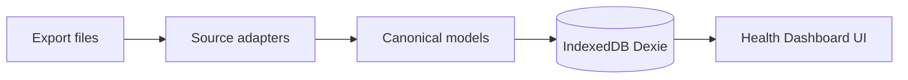

# Health Dashboard — Implementation Plan (v1)

## Context

- **Product name:** **Health Dashboard** (UI copy, repo title, and user-facing strings). Do **not** brand the app after a single vendor.
- **Workspace:** The repo at [`c:\Users\ryanm\OneDrive\Documents\projects\health-data-dashboard`](c:\Users\ryanm\OneDrive\Documents\projects\health-data-dashboard) is empty; this is a **greenfield** scaffold.
- **Runtime:** Web app — users **import files via file input**; data lives in **IndexedDB** via **Dexie** (no backend in v1).
- **Sources:** v1 ships **one import adapter** — **BP Doctor Fit CSV** exports (the schema doc you wrote). The **canonical models** are the stable contract; each future platform adds a new adapter that maps into the same types (and sets `source` / `source_file` metadata).

## Architecture (high level)

- **Adapters:** Folder per source (e.g. `src/import/sources/bpDoctorFit/`) implementing a small interface — “parse this file text → canonical rows.” Routing: by filename and/or header detection; later sources get parallel folders without renaming the app.
- **Parsing:** Adapters emit only **shared TypeScript types** (no vendor-specific shapes in UI or DB layer).
- **Storage:** Single Dexie database with object stores aligned to `TimeseriesSamples`, `BloodPressureReading`, `SleepSession`, `SportSession`, `WeightMeasurement` (prefer **separate stores** for BP/sleep/sport/weight and a **timeseries store** for samples). Optional `source` field on rows if multiple platforms coexist later.

## Dexie and IndexedDB (how it works here)

- **IndexedDB** is a **browser-built-in** database: asynchronous, transactional, and **per-origin** (same scheme + host + port as the app). Data persists across sessions until the user clears site data or the app deletes it.
- **Dexie.js** is a thin **JavaScript wrapper** over IndexedDB: you declare **table names**, **primary keys**, and **indexes** in TypeScript-friendly code, then `await` queries like `table.where('timestamp').between(a,b).toArray()`.
- **Nothing is sent to a server** by Dexie itself — health data stays on the user’s machine inside the browser profile for this site. Large histories are feasible; use **indexes on time fields** so range filters stay fast as months/years of samples accumulate.
- **Limitations to know:** No SQL; backup/restore is **export/import** (optional future feature). Private browsing may discard data when the session ends (browser-dependent).

## Privacy (how it is handled)

- **At import:** CSV preambles that contain **User Name / Phone / Email** are **skipped** and **must not** be written to IndexedDB, shown in UI, or logged to console. Only health rows + device/source columns as defined in canonical models.
- **In storage:** Dexie holds **structured health metrics** the user chose to import — same sensitivity as the original files, but **not** duplicated to a cloud in v1.
- **In UI:** Records/debug views show **aggregates** (counts, file names) and optionally **scrubbed** snippets — never raw preamble lines.
- **Multi-user device:** Anyone with access to the browser profile can open the app and see stored data — mitigations are OS-level (user account, disk encryption) or an optional future app-level lock; **out of scope for v1** unless added to the plan explicitly.
- **Extensions & devtools:** Treat health data like credentials — avoid `console.log` of rows in production builds.

## 1. Project bootstrap

- Create **Vite + React + TypeScript** app in the repo root.
- Add dependencies: **Dexie** (IndexedDB), **papaparse** (robust CSV), **date-fns** or **dayjs** (optional, for date math/rolling windows), **zod** (optional, runtime validation of parsed rows).
- Configure path aliases if desired (`@/` for `src/`).

## 2. Canonical types ([`src/types/canonical.ts`](src/types/canonical.ts) or split by domain)

Implement interfaces matching your spec:

| Model | Key fields |
|--------|------------|
| `TimeseriesSample` | `metric_type`, `timestamp`, `value`, `unit`, `source_file`, `device`, `data_source` |
| `BloodPressureReading` | `timestamp`, `systolic`, `diastolic`, `pulse`, `source_file`, `device`, `data_source` |
| `SleepSession` | `start_time`, `end_time`, minute fields, `source_file`, `device` |
| `SportSession` | sport/duration/distance/calories/HR/speed/steps/cadence + `measurement_time`, `source_file`, `device` |
| `WeightMeasurement` | `timestamp`, `weight_kg`, `source_file`, `device`, `data_source` |

- **`metric_type`:** TypeScript `enum` or string union: `heart_rate` | `calories` | `steps` | `pressure` | `oxygen` | `breathing` | `hrv`.
- **Units:** Central map `metric_type → default unit` for display (e.g. `bpm`, `kcal`, `steps`, `%`, `times/min`).

## 3. CSV import rules (shared utilities; used by BP Doctor Fit adapter and future adapters)

Implement in [`src/import/csvUtils.ts`](src/import/csvUtils.ts) (names illustrative):

1. **`parseNaiveTimestamp(s: string): Date`** — `YYYY-MM-DD HH:MM:SS`, treat as local naive (no TZ conversion in v1).
2. **`parseDurationToMinutes(hms: string): number`** — `HH:MM:SS` → total minutes (integer for sleep/sport per spec).
3. **`skipPreambleUntilHeader(lines or Papa result, headerProbe): number | header row`** — For Sleep, Sport, HRV, Weight: advance until a row whose cells include known anchor column(s), e.g. `Sleep Duration`, `Sport Type`, `HRV（RRI）`, `Weight (kg)`. HRV empty body is valid.
4. **Never** expose `User Name`, `User Phone Number`, `User Email` in UI or structured debug payloads.

**Filename → parser routing:** Map expected filenames (`HeartRate_Data.csv`, `Heat_Data-2.csv`, …) from section 1 of your doc to dedicated importers; optionally allow “detect by header” fallback for minor name variants.

## 4. BP Doctor Fit CSV — per-file importers (v1)

Each importer: `parseXxxCsv(text: string, sourceFileName: string): CanonicalModel[]`.

| File | Output |
|------|--------|
| HeartRate | `TimeseriesSample` (`heart_rate`) |
| Heat | `TimeseriesSample` (`calories`) |
| HRV | preamble skip; 0+ rows → `TimeseriesSample` (`hrv`) |
| Sleep | preamble skip → `SleepSession` |
| Sport | preamble skip → `SportSession` |
| Step | `TimeseriesSample` (`steps`) |
| Pressure | `TimeseriesSample` (`pressure`) — UI label “Wrist pressure index” (or similar) |
| Weight | preamble skip → `WeightMeasurement` |
| BloodOxygen | `TimeseriesSample` (`oxygen`) |
| BloodPressure | `BloodPressureReading` |
| Breathing | `TimeseriesSample` (`breathing`) |

Handle sparse/empty: return `[]` without error; surface “imported, 0 rows” in Records UI.

## 5. Persistence (Dexie)

- **Schema v1:** Stores: `timeseries`, `bloodPressure`, `sleepSessions`, `sportSessions`, `weightMeasurements`, plus optional `importMeta` (file name, importedAt, row counts) for **Records** view — **without** storing preamble PII.
- **Import strategy:** Replace vs merge — for v1, **simplest**: clearing previous data for the same `source_file` on re-import, or full “clear all” before batch import; document choice in code comments.

## 6. Derived metrics (for dashboard)

Small pure functions (e.g. [`src/metrics/aggregates.ts`](src/metrics/aggregates.ts)):

- Latest value per metric from timeseries (by max `timestamp`).
- 7-day rolling average for BP (from `BloodPressureReading` filtered by date range).
- Daily steps: latest step sample per calendar day or max value that day (document assumption: cumulative intraday → use **max per local day** for “latest daily steps” consistency).

## 7. UI (React)

Minimal, cohesive layout:

- **Import:** Button + `<input type="file" multiple accept=".csv" />`; run parsers; write to Dexie; toast or inline summary (counts per file).
- **Overview:** Latest BP, 7-day BP avg, latest HR, SpO2, breathing, daily steps, weight if any — all from queries over canonical stores.
- **Blood Pressure:** Line/scatter chart of readings + rolling average (use **Recharts** or **Chart.js** wrapper — pick one and stay consistent).
- **Activity:** Steps + calories charts; table or timeline of `SportSession`.
- **Recovery:** Sleep list/chart; SpO2 + breathing from timeseries.
- **Records:** Group by `source_file`, show row counts and last import time — **no raw CSV preview of preamble** (optional: show column headers + first data row only if needed for debugging, still scrubbing known PII columns).

### 7.1 Temporal navigation and drill-down (weeks → months → years)

Long histories need a **single, predictable time context** everywhere plus **progressive detail** without clutter.

**Global time range (recommended)**

- One **app-level** `DateRange` (`start`, `end`, inclusive) stored in React context (or URL search params like `?from=2026-01-01&to=2026-04-12` for shareable/bookmarked views).
- **Presets** in a compact control: Last 7 days, Last 30 days, Last 90 days, This month, This year, **All data** (min/max timestamp from DB), plus **Custom** (two date inputs or a small range picker).
- Optional: **Previous / Next** nudge buttons that slide the window by the current window length (e.g. move “March” view to February) for calendar-like exploration.

**Drill-down patterns (elegant, complementary)**

1. **Chart-first:** Main charts support **brush / zoom** (Recharts `Brush` or similar) — user drags on a secondary timeline or selects a region; updates global `DateRange` so lists and KPIs stay in sync (“what you see is what’s selected”).
2. **Calendar strip / heatmap:** A thin **month grid** or week row under the header showing density (e.g. days with any BP reading, or daily step total). Clicking a day or week **narrows** the global range to that period.
3. **Session lists:** Sleep and sport are naturally **one row per session** — default sort by `start_time` / `measurement_time` descending; clicking “that night” or “that workout” can narrow the range to that day for related charts.
4. **Breadcrumb:** When zoomed, show `All data › March 2026 › Mar 8–14` with clicks to pop back up a level (implemented as widening `DateRange`).

**Aggregation by zoom level (performance + clarity)**

- Raw points for dense series (HR, breathing) become noisy at month/year scale — query by range then **bucket** for display:
  - **Day** view: raw or hourly rollups as needed.
  - **Week/month** view: daily aggregates (min/max/avg per day).
  - **Year** view: weekly or monthly aggregates.
- BP: always show **individual readings** when zoomed in; at wide zoom, **daily avg** + optional min/max band.
- Steps: **max per local day** (cumulative semantics) for “daily total” series across any span.

**Technical hooks**

- Dexie queries: **`timestamp` / `start_time` / `end_time` indexed** where possible; `where('timestamp').between(start, end)` (or compound indexes if you add `metric_type` + time).
- Pure helpers: `bucketTimeseries(samples, range, granularity: 'hour' | 'day' | 'week' | 'month')` for chart input.
- Overview “latest” KPIs can ignore global range or use a **fixed** “last 7 days” — call out in UI (“Last 7 days” vs “Selected range”) to avoid confusion.

## 8. Testing (recommended)

- **Unit tests** (Vitest): `parseDurationToMinutes`, timestamp parsing, preamble skipping with fixture strings, one golden CSV snippet per file type.
- No E2E required for v1 unless you want Playwright later.

## 9. Out of scope (explicit for v1)

- **Additional import adapters** (Apple Health, Garmin, etc.) — **not implemented** in v1, but **folder layout and canonical types** should make adding a new `src/import/sources/<vendor>/` straightforward.
- **CSV that does not match** a registered adapter — reject with a clear error or “unsupported file.”
- **Timezone conversions** and cross-device merge logic — **not implemented** (naive local timestamps as today).
- **Cloud sync, accounts, backend API** — **not implemented**.

## Key files to add (illustrative)

| Area | Files |
|------|--------|
| Types | `src/types/canonical.ts`, `src/types/metric.ts` |
| Import | `src/import/csvUtils.ts`, `src/import/sources/bpDoctorFit/*.ts` (first adapter; more sources later) |
| DB | `src/db/schema.ts`, `src/db/repository.ts` |
| Metrics | `src/metrics/aggregates.ts`, `src/metrics/bucketing.ts` (range rollups) |
| Time UI | `src/time/DateRangeContext.tsx`, `src/components/DateRangeControl.tsx` |
| UI | `src/App.tsx`, `src/pages/*` or `src/routes/*`, shared `Layout` |

## Risk / assumption

- **Column names:** Real exports may use slight variants (e.g. full-width parentheses). Implement header matching with **normalized string** (trim, optional Unicode normalization) and a small alias list if imports fail.
- **Step semantics:** “Cumulative through the day” — Overview “latest daily steps” should use **max steps on the latest day with data** (or last reading of that day), not only the global latest timestamp if it spans quirks.
