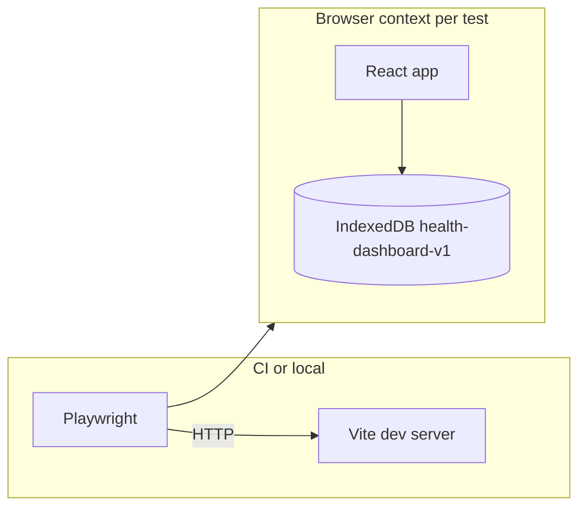

# E2E-first automated test suite

## Context

- **App**: [package.json](c:\Users\ryanm\OneDrive\Documents\projects\health-data-dashboard\package.json) — Vite 8 + React 19; no router; tabs and state live in [src/App.tsx](c:\Users\ryanm\OneDrive\Documents\projects\health-data-dashboard\src\App.tsx).
- **Persistence**: IndexedDB via Dexie, database name `health-dashboard-v1` in [src/db/schema.ts](c:\Users\ryanm\OneDrive\Documents\projects\health-data-dashboard\src/db/schema.ts).
- **Import pipeline**: [src/import/runImport.ts](c:\Users\ryanm\OneDrive\Documents\projects\health-data-dashboard\src\import\runImport.ts) always uses the BP Doctor Fit adapter (`parseBpDoctorFitFile` + `persistImportBundle`). There is no second importer path in app code today.
- **Existing tests**: Vitest + RTL + jsdom ([vite.config.ts](c:\Users\ryanm\OneDrive\Documents\projects\health-data-dashboard\vite.config.ts)); unit tests in [src/import/sources/bpDoctorFit/parsers.test.ts](c:\Users\ryanm\OneDrive\Documents\projects\health-data-dashboard\src\import\sources\bpDoctorFit\parsers.test.ts) and [src/import/csvUtils.test.ts](c:\Users\ryanm\OneDrive\Documents\projects\health-data-dashboard\src\import\csvUtils.test.ts). **No browser/E2E runner today.**

## Why Playwright (E2E layer)

- First-class **file upload** (`setInputFiles`) for [ImportPanel](c:\Users\ryanm\OneDrive\Documents\projects\health-data-dashboard\src\components\ImportPanel.tsx).
- **Per-test browser contexts** give isolated IndexedDB for `http://127.0.0.1:<port>` without manual DB teardown in most cases.
- Built-in **trace/screenshot/video** on failure, `webServer` hook to start Vite, and solid TypeScript defaults.

(Cypress is viable; Playwright is the better default here for CI parallelism and fixture uploads.)

## Architecture

## Implementation plan

### 1. Dependencies and config

- Add `@playwright/test` as a devDependency; run `npx playwright install` (browsers) locally once; document CI with `npx playwright install --with-deps` on Linux if needed.
- **ESLint**: [eslint.config.js](c:\Users\ryanm\OneDrive\Documents\projects\health-data-dashboard\eslint.config.js) currently applies React/Vite rules to all `**/*.{ts,tsx}`. Add an override or `globalIgnores` for `e2e/**` (or a Playwright-specific flat config block with `globals.node`) so Playwright specs are not incorrectly linted as React components.
- Add [playwright.config.ts](c:\Users\ryanm\OneDrive\Documents\projects\health-data-dashboard\playwright.config.ts) at repo root:
  - `testDir: 'e2e'`
  - `fullyParallel: true`, sensible `timeout` / `expect.timeout`
  - `use.baseURL` = `http://127.0.0.1:5173` (or match Vite default)
  - `webServer`: `npm run dev -- --host 127.0.0.1 --port 5173`, `reuseExistingServer: !process.env.CI`, `timeout` ~120s
- **`.gitignore`**: add Playwright artifacts (`test-results/`, `playwright-report/`, `blob-report/`, `playwright/.cache/` if used).

### 2. Fixtures

- Create `e2e/fixtures/` with **small valid CSVs** copied from the known-good strings in [parsers.test.ts](c:\Users\ryanm\OneDrive\Documents\projects\health-data-dashboard\src\import\sources\bpDoctorFit\parsers.test.ts) (e.g. one blood pressure file, one heart rate file).
- **Filename is load-bearing**: [parseBpDoctorFitFile](c:\Users\ryanm\OneDrive\Documents\projects\health-data-dashboard\src\import\sources\bpDoctorFit\index.ts) matches the **filename** (case-insensitive substrings) to pick parsers and throws `Unsupported CSV for BP Doctor Fit adapter` if none match. Examples that work: `BloodPressure_Data-10.csv` (`bloodpressure`), `HeartRate_Data.csv` (`heartrate`). A generic name like `sample.csv` will **fail** import.

### 3. E2E specs (priority order)

| File | Intent |
|------|--------|
| `e2e/smoke.spec.ts` | Visit `/`, `expect` document title **Health Dashboard** ([index.html](c:\Users\ryanm\OneDrive\Documents\projects\health-data-dashboard\index.html)), visible **Health Dashboard** heading and main tab labels (Overview, Blood pressure, …). |
| `e2e/navigation.spec.ts` | Click each tab button; assert each page’s `<h2>` via `getByRole('heading', { name: '...' })`. **Exact headings in code**: Overview, Blood pressure, Activity, Recovery, **Import records** (the tab button label is “Records” but the heading is “Import records” — do not assert `"Records"` as the heading). |
| `e2e/import.spec.ts` | Use `setInputFiles` on the hidden `input[type=file]` (or click **Import CSV** then set files). Assert import status in `.import-status` and/or KPI text changes from `—` to expected values (e.g. **128/75** for BP from the fixture). |
| `e2e/clear-data.spec.ts` (optional) | `page.once('dialog', d => d.accept())`, click **Clear all**, assert status text **All data cleared.** (see [ImportPanel](c:\Users\ryanm\OneDrive\Documents\projects\health-data-dashboard\src\components\ImportPanel.tsx)) and/or KPIs return to em dash. |

**Selectors**: Prefer `getByRole`, `getByText`, and existing classes already used in the UI (`tab-btn`, `import-status`, `kpi-value`) to avoid brittle CSS-only hooks.

**Dialogs**: [ImportPanel](c:\Users\ryanm\OneDrive\Documents\projects\health-data-dashboard\src\components\ImportPanel.tsx) uses `confirm()` for clear — register the dialog handler before clicking.

### 4. npm scripts

In [package.json](c:\Users\ryanm\OneDrive\Documents\projects\health-data-dashboard\package.json):

- `"test:e2e": "playwright test"`
- `"test:e2e:ui": "playwright test --ui"` (local debugging)
- Optionally `"test:all": "npm run test && npm run test:e2e"` once E2E is stable.

Keep existing `"test"` as Vitest-only so unit tests stay fast and separate from browser runs.

### 5. CI (when you add a pipeline)

- Job order: `npm ci` → `npx playwright install --with-deps` → `npm run build` (sanity) → `npm run test:e2e`.
- Upload Playwright HTML report as an artifact on failure.

### 6. After E2E (explicitly not in first slice)

- Add more Vitest coverage for pure logic; add RTL tests for isolated components only where E2E is too heavy. **Do not block E2E setup on this** — the user asked for E2E first.

## Risks and mitigations

- **Flaky dev server**: Rely on `webServer.url` wait; increase `timeout` on slow machines.
- **Strict mode double effects**: If any test sees duplicate network/IDB writes, use stable assertions (e.g. wait for KPI text) rather than counting renders.
- **Port conflicts**: Pin host/port in `webServer` and `baseURL` consistently.

## Files to add or touch

- **New**: `playwright.config.ts`, `e2e/**/*.spec.ts`, `e2e/fixtures/*.csv`, `.gitignore` (Playwright output dirs).
- **Update**: [package.json](c:\Users\ryanm\OneDrive\Documents\projects\health-data-dashboard\package.json) scripts and devDependencies; [eslint.config.js](c:\Users\ryanm\OneDrive\Documents\projects\health-data-dashboard\eslint.config.js) as above.

No application source changes are required unless you later add `data-testid` attributes for ambiguous regions (optional).
