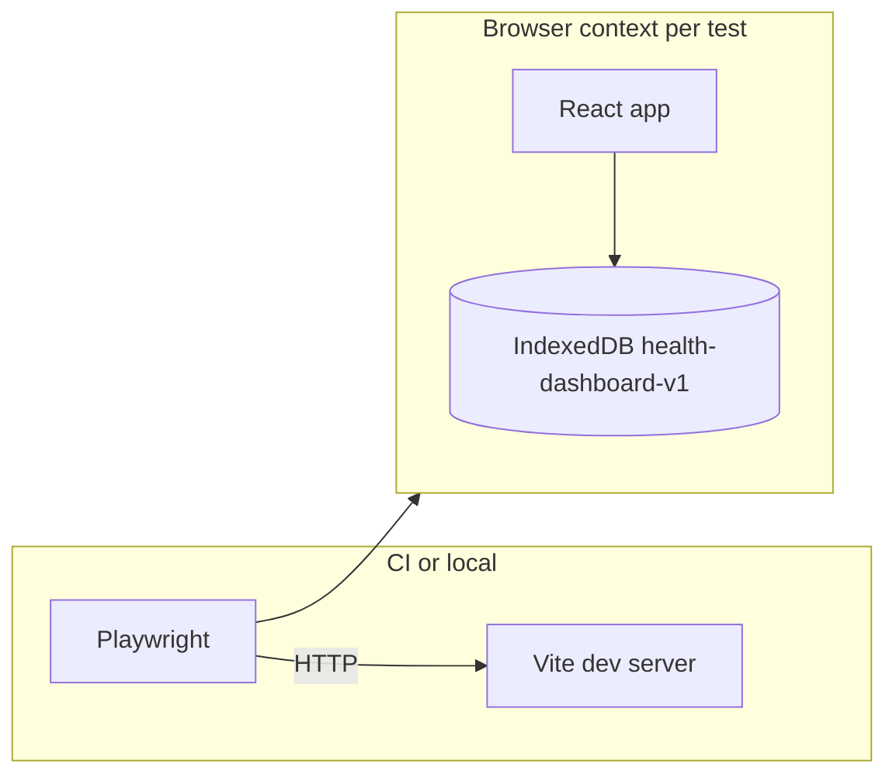

# E2E-first automated test suite

## Context

- **App**: [package.json](c:\Users\ryanm\OneDrive\Documents\projects\health-data-dashboard\package.json) -- Vite 8 + React 19; no router; tabs and state live in [src/App.tsx](c:\Users\ryanm\OneDrive\Documents\projects\health-data-dashboard\src\App.tsx).
- **Tabs** (5): `overview | bp | activity | recovery | import`. Each tab button has an SVG icon ([TabIcons.tsx](c:\Users\ryanm\OneDrive\Documents\projects\health-data-dashboard\src\components\TabIcons.tsx)) and a text label: **Overview**, **Blood pressure**, **Activity**, **Recovery**, **Import**.
- **Header**: contains `<h1>Health Dashboard</h1>` and a [ThemeControl](c:\Users\ryanm\OneDrive\Documents\projects\health-data-dashboard\src\components\ThemeControl.tsx) dropdown (Light / Dark / Auto). Import controls are NOT in the header -- they only appear inside the Import tab.
- **Import tab layout**: When `tab === 'import'`, App renders [ImportPanel](c:\Users\ryanm\OneDrive\Documents\projects\health-data-dashboard\src\components\ImportPanel.tsx) (file input + clear button) followed by [RecordsPage](c:\Users\ryanm\OneDrive\Documents\projects\health-data-dashboard\src\pages\RecordsPage.tsx) (import history table). The DateRangeControl toolbar is hidden on this tab.
- **Persistence**: IndexedDB via Dexie, database name `health-dashboard-v1` in [src/db/schema.ts](c:\Users\ryanm\OneDrive\Documents\projects\health-data-dashboard\src\db\schema.ts).
- **Import pipeline**: [src/import/runImport.ts](c:\Users\ryanm\OneDrive\Documents\projects\health-data-dashboard\src\import\runImport.ts) always uses the BP Doctor Fit adapter. Filename substrings route to parsers in [bpDoctorFit/index.ts](c:\Users\ryanm\OneDrive\Documents\projects\health-data-dashboard\src\import\sources\bpDoctorFit\index.ts).
- **Existing tests**: Vitest + RTL + jsdom; unit tests for CSV parsers. **No browser/E2E runner today.**

## Page inventory (what to test after import)

### Overview (KPI grid)
- 7 KPI cards: Latest BP, 7-day BP avg, Latest HR, Latest SpO2, Latest breathing, Latest steps, Latest weight
- Values show em dash when no data; populated values from imported fixtures
- Selectors: `.kpi-grid`, `.kpi`, `.kpi-title`, `.kpi-value`

### Blood pressure tab
- **Readings chart**: Recharts `LineChart` with systolic/diastolic lines, threshold reference lines
- **Daily averages chart**: `LineChart` with `sysAvg`/`diaAvg` lines
- Empty state: `p.muted` "No readings in this range..."
- Wrapped in `CollapsibleChartCard` using `
` / `.collapsible-card-title`

### Activity tab
- **Steps chart**: bucketed `LineChart` (dataKey `max`)
- **Calories chart**: bucketed `LineChart` (dataKey `avg`)
- **Sport sessions table**: `table.data-table` with columns Time, Type, Duration, Distance, kcal, Steps
- Empty state: `p.muted` "No activity data in this range."
- Sport table can independently show "No sport sessions in range."

### Recovery tab
- **SpO2 chart**: `LineChart`, Y domain [80, 100]
- **Breathing chart**: `LineChart`
- **Sleep windows**: `ScatterChart` (collapsed by default)
- **Sleep stage stack**: `BarChart` with deep/light/awake bars
- **Sleep sessions table**: `table.data-table` (Start, End, Total, Deep, Light, Awake)
- Empty state: `p.muted` "No recovery metrics in this range."

### Import tab
- **Records table**: `table.data-table` with columns File Name, Date Range, Data Type, Data Count, Imported At
- Empty state: `p.muted` "No imports yet."

### Date range control (shared)
- Presets: 2d, 7d, 30d, 90d, Month, Year, All
- `.preset-btn` / `.preset-btn.active`, `.breadcrumb`
- Visible on all tabs except Import
- Range anchors to latest data point in DB

## Why Playwright

- First-class **file upload** (`setInputFiles`), per-test browser contexts (isolated IndexedDB), built-in trace/screenshot on failure, `webServer` hook for Vite.

## Architecture

## Implementation plan

### 1. Dependencies and config

- Add `@playwright/test` as a devDependency; run `npx playwright install` locally.
- **ESLint**: [eslint.config.js](c:\Users\ryanm\OneDrive\Documents\projects\health-data-dashboard\eslint.config.js) -- add `globalIgnores` for `e2e/**` so Playwright specs are not linted as React code.
- Add `playwright.config.ts` at repo root:
  - `testDir: 'e2e'`, `fullyParallel: true`
  - `use.baseURL` = `http://127.0.0.1:5173`
  - `webServer`: `npm run dev -- --host 127.0.0.1 --port 5173`, `reuseExistingServer: !process.env.CI`
- `.gitignore`: add `test-results/`, `playwright-report/`, `blob-report/`

### 2. Fixtures (comprehensive)

Create `e2e/fixtures/` with one CSV file per data type. Filenames must contain the routing substring. Use multiple rows with different timestamps to enable date range filtering tests.

- `BloodPressure_Data.csv` -- 3+ readings across different dates (e.g. 2026-03-01, 2026-03-15, 2026-04-01). Values like 128/75/62, 135/82/70, 120/70/58.
- `HeartRate_Data.csv` -- 3+ samples across dates. Values like 73, 80, 65.
- `Step_Data.csv` -- 3+ samples. Values like 100, 5000, 8000.
- `Heat_Data.csv` -- 3+ calorie samples. Values like 99, 250, 180.
- `BloodOxygen_Data.csv` -- 3+ samples. Values like 97, 98, 96.
- `Breathing_Data.csv` -- 3+ samples. Values like 18, 16, 17.
- `Weight_Data.csv` -- 2+ weight readings. Values like 58.9, 59.2.
- `Sleep_Data.csv` -- 2+ sessions with start/end times and stage durations. **(Synthetic -- no test string exists in parsers.test.ts.)** Header: `Start Sleep Time,End Sleep Time,Sleep Duration,Deep Sleep Duration,Shallow Sleep Duration,Awakening Duration,Measuring Device`.
- `Sport_Data.csv` -- 2+ sport sessions. **(Synthetic.)** Header: `Sport Type,Measurement Time,Exercise Duration,Average Heart Rate (times/minute),Distance (m),Calories Burned (kcal),Average Speed (km/h),Steps,Average Cadence (steps/minute),Measuring Device`.

**Date strategy**: Spread fixture timestamps across 2026-03-01 to 2026-04-10. This lets us test:
- "All" preset shows everything
- "7d" preset (anchored to latest data point, April 10) filters to only April data
- "30d" shows March-April data
- Narrow presets produce empty states on some pages

### 3. Shared test helpers (`e2e/helpers.ts`)

- `importFixtures(page, ...filenames)` -- Navigate to Import tab, `setInputFiles` on `input[type=file]`, wait for `role="status"` banner with success text.
- `navigateToTab(page, label)` -- Click the tab button matching `label`, wait for corresponding `<h2>`.
- `getKpiValue(page, title)` -- Locate `.kpi` with matching `.kpi-title`, return `.kpi-value` text.

### 4. E2E specs

#### `e2e/smoke.spec.ts`
- Visit `/`, assert title "Health Dashboard", visible h1, all 5 tab labels, ThemeControl (`aria-label="Color theme"`).

#### `e2e/navigation.spec.ts`
- Click each tab; assert `<h2>` heading: Overview, Blood pressure, Activity, Recovery, Import.
- Assert DateRangeControl toolbar visible on data tabs, hidden on Import tab.

#### `e2e/import.spec.ts`
- Navigate to Import tab, import **all fixture files** via multi-file `setInputFiles`.
- Assert banner: `role="status"` with text matching "Imported 9 files successfully."
- Assert records table (`table.data-table`) has 9 rows with correct file names.
- Assert each row shows a non-zero data count.
- Import a file with a bad name (e.g. `invalid.csv`) and assert the error banner.

#### `e2e/overview.spec.ts`
- Import all fixtures, navigate to Overview.
- Assert each KPI populates with real values (not em dash):
  - Latest BP contains "mmHg"
  - 7-day BP avg contains "/" (systolic/diastolic)
  - Latest HR contains "bpm"
  - Latest SpO2 contains "%"
  - Latest breathing contains "/min"
  - Latest steps contains "steps"
  - Latest weight contains "kg"

#### `e2e/blood-pressure.spec.ts`
- Import BP fixture, navigate to Blood pressure tab.
- Assert **no** empty-state message ("No readings in this range").
- Assert chart cards are visible: look for `.collapsible-card-title` containing "Readings" and "Daily averages".
- Assert Recharts SVG renders (`.recharts-wrapper` exists, has `<svg>` with `<path>` elements).
- **Empty state test**: Without importing BP data, navigate to BP tab and assert "No readings in this range" is visible.

#### `e2e/activity.spec.ts`
- Import steps + calories + sport fixtures, navigate to Activity tab.
- Assert no empty state.
- Assert chart cards visible: title text "Steps" and "Calories".
- Assert Recharts SVGs render with paths.
- Assert sport sessions table (`table.data-table`) is present inside a collapsible card and has rows.
- **Empty state test**: No data imported -> "No activity data in this range."

#### `e2e/recovery.spec.ts`
- Import SpO2 + breathing + sleep fixtures, navigate to Recovery tab.
- Assert no empty state.
- Assert chart cards: "SpO2" and "Breathing" charts render with SVGs.
- Assert sleep sessions table is present with rows (Start, End, Total columns).
- Assert sleep chart cards exist: "Sleep windows", "Sleep stage time".
- **Empty state test**: No data -> "No recovery metrics in this range."

#### `e2e/date-range.spec.ts`
- Import all fixtures (timestamps spanning 2026-03-01 to 2026-04-10).
- Navigate to BP tab. Assert charts show data.
- Click "7d" preset. Assert breadcrumb updates to a date range string. Assert charts still show data (April readings within 7d of anchor).
- Click "2d" preset. If only 1 reading falls in that window, assert chart still renders (or could be empty depending on fixture density).
- Click "All" preset. Assert breadcrumb shows "All data". Assert charts show all readings.
- **Cross-tab check**: Switch to Activity tab after "7d" is active. Assert the same date range applies (or produces an appropriate empty state if no activity data in that window).

#### `e2e/clear-data.spec.ts`
- Import a fixture file, navigate to Import tab.
- Click "Clear all" button. Assert `<dialog>` modal opens with heading "Clear all data?".
- Click "Cancel". Assert modal closes, data is still present (records table still has rows).
- Click "Clear all" again, then click "Clear all data" (confirm button). Assert banner shows "All data cleared."
- Navigate to Overview. Assert all KPIs show em dash.
- Navigate back to Import tab. Assert records table shows "No imports yet."

### 5. Selector strategy

- **Headings/text**: `getByRole('heading')`, `getByText()` for tab labels, KPI titles, empty-state messages
- **Classes already in the UI**: `.kpi-value`, `.kpi-title`, `.kpi-grid`, `.tab-btn`, `.preset-btn`, `.breadcrumb`, `.collapsible-card-title`, `.data-table`, `.import-banner`
- **Roles**: `role="status"` on import banner, native `
`/`
` for collapsible cards
- **Charts**: Recharts renders `.recharts-wrapper > svg`. Assert SVG presence and child `<path>` or `<line>` elements. Do NOT assert exact pixel coordinates or path `d` attributes (fragile). For chart type verification, check for `.recharts-line` (line charts), `.recharts-bar` (bar charts), `.recharts-scatter` (scatter charts).

### 6. npm scripts

In [package.json](c:\Users\ryanm\OneDrive\Documents\projects\health-data-dashboard\package.json):

- `"test:e2e": "playwright test"`
- `"test:e2e:ui": "playwright test --ui"`
- `"test:all": "npm run test && npm run test:e2e"`

### 7. CI (when you add a pipeline)

- Job: `npm ci` -> `npx playwright install --with-deps` -> `npm run build` -> `npm run test:e2e`
- Upload Playwright HTML report as artifact on failure.

## Risks and mitigations

- **Flaky dev server**: `webServer.url` wait + generous timeout.
- **Chart assertion fragility**: Only assert SVG presence and Recharts wrapper classes, never pixel values or path data.
- **Date anchoring**: Date range presets anchor to the latest data point. Fixture timestamps must be deterministic so assertions are stable regardless of when tests run. Use fixed dates (not relative).
- **Strict mode double effects**: Use stable text/DOM assertions, not render counts.
- **Port conflicts**: Pin host/port in `webServer` and `baseURL`.

## Files to add or touch

- **New**: `playwright.config.ts`, `e2e/helpers.ts`, `e2e/*.spec.ts` (8 spec files), `e2e/fixtures/*.csv` (9 fixture files)
- **Update**: [package.json](c:\Users\ryanm\OneDrive\Documents\projects\health-data-dashboard\package.json) (scripts + devDep), [eslint.config.js](c:\Users\ryanm\OneDrive\Documents\projects\health-data-dashboard\eslint.config.js) (globalIgnores)

No application source changes required.
