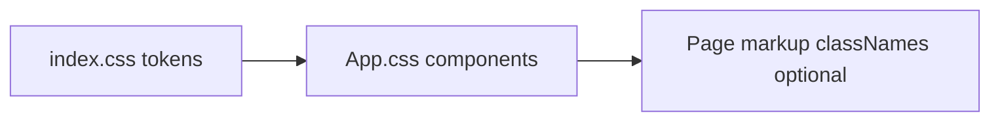

# UI/UX visual polish (health dashboard)

## Current state

- **Stack**: React 19, Vite, [Recharts](https://recharts.org/), no Tailwind or component library.
- **Styling**: Global tokens in [`src/index.css`](c:\Users\ryanm\OneDrive\Documents\projects\health-data-dashboard\src\index.css); layout and components in [`src/App.css`](c:\Users\ryanm\OneDrive\Documents\projects\health-data-dashboard\src\App.css). Theme is toggled via `data-theme` on `:root` (see [`index.html`](c:\Users\ryanm\OneDrive\Documents\projects\health-data-dashboard\index.html)).
- **Pain points**: System-only typography, mostly flat 1px borders, tabs and toolbar read as “default buttons,” KPI/chart blocks lack a cohesive surface hierarchy, and charts use default Recharts chrome (grid/axes) against a plain background.

## Recommended direction

Keep **one accent** (refine the existing purple or shift to a slightly calmer violet/teal for “health” feel—your call during implementation) and add **subtle depth**: page background vs. card background, soft shadows, consistent corner radius, and short transitions on hovers/focus. This stays maintainable and matches the small codebase.

## Implementation plan

### 1. Expand design tokens (`index.css`)

- Add semantic variables, for example: `--surface` (page), `--surface-raised` (cards/toolbars), `--ring` or reuse `--accent-border` for focus, `--radius-sm` / `--radius-md` / `--radius-lg`, and a **shadow scale** (e.g. `--shadow-sm` for KPI/chart cards, lighter than current `--shadow` or split into two steps).
- Light mode: very subtle warm or cool off-white for `--bg`, slightly lighter “card” for `--surface-raised` (or inverse: gray-50 page + white cards).
- Dark mode: mirror with layered grays so borders are not the only separator.
- Optionally load **one display + one UI font** via `<link>` in [`index.html`](c:\Users\ryanm\OneDrive\Documents\projects\health-data-dashboard\index.html) (e.g. a distinctive sans for headings, neutral sans for body)—still system fallback if fonts fail.

### 2. Shell layout: header, tabs, toolbar (`App.css` + minimal `App.tsx` if needed)

- **Header**: Tighter vertical rhythm; optional thin bottom border or soft background strip so brand + actions feel like a bar, not floating text.
- **Tabs**: Move from plain bordered buttons to a **segmented control** style (shared rounded track, active pill with `--accent-bg` and clear contrast), with `transition` on background/border.
- **Tab symbols (blood pressure, activity, recovery)**: Add a small **leading symbol** next to the label for those three tabs—implemented as **inline SVG** (no new npm dependency, consistent on Windows/macOS/Linux). Suggested pairing: heart + pulse (BP), walking/person-activity (activity), moon or bed (recovery). Icons are `aria-hidden`; the button text remains the full name for screen readers. Optionally add matching symbols for **Overview** (e.g. layout grid or chart) and **Import** (upload) so the row feels balanced—optional during implementation.
- **Toolbar** ([`DateRangeControl`](c:\Users\ryanm\OneDrive\Documents\projects\health-data-dashboard\src\components\DateRangeControl.tsx)): Place inside a raised surface (padding + `--surface-raised` + radius); style **breadcrumb** as smaller uppercase or tabular tracking if it stays readable; **preset buttons** as compact chips (active state when matching current preset would require a small prop from context—only add if low-cost; otherwise keep visual-only hover polish).

### 3. Content surfaces: KPIs, charts, tables (`App.css`; optional class wrappers in pages)

- **KPI grid** (`.kpi`): Use `--surface-raised`, `--radius-md`, `--shadow-sm`, slightly increased padding; optional hover lift (`translateY` + shadow) for delight without clutter.
- **Charts**: Introduce a wrapper class (e.g. `.chart-card`) applied in pages that host [`ResponsiveContainer`](c:\Users\ryanm\OneDrive\Documents\projects\health-data-dashboard\src\pages\BloodPressurePage.tsx) (and the same pattern on Activity/Recovery/Overview charts): padding, radius, subtle border or shadow. In [`index.css`](c:\Users\ryanm\OneDrive\Documents\projects\health-data-dashboard\index.css), add Recharts overrides so **grid lines** use `--border` at lower opacity and **axis tick** color uses `--text`—reduces the “default chart library” look.
- **Tables** (`.data-table` / `.table-wrap` on [`RecordsPage`](c:\Users\ryanm\OneDrive\Documents\projects\health-data-dashboard\src\pages\RecordsPage.tsx)): Round the outer container, overflow hidden; soften header background to `--surface-raised` or `--code-bg`; optional zebra striping with a token like `--table-stripe`.

### 4. Buttons and form controls (`App.css`)

- Unify **primary** (Import / main actions), **secondary** (outline), **danger** with consistent height, radius, and focus ring.
- **Theme select** and **file import** row: align heights with buttons; consider a single “control height” variable.

### 5. QA

- Toggle **light/dark** and scroll **Overview, BP, Activity, Recovery, Import** to verify contrast and chart readability.
- Resize **narrow viewport**: tabs and preset row should still wrap cleanly (flex already present; adjust gaps if needed).

## Out of scope (unless you want them later)

- Adding Tailwind, Radix, or shadcn (large dependency and refactor for this codebase size).
- **Icon npm packages** (Lucide, etc.); tab symbols use **inline SVG** or Unicode only.
- Full illustration work or redesigning data visualization semantics (same charts, nicer frame).

## Files likely touched

| Area | Files |
|------|--------|
| Tokens + Recharts globals | [`src/index.css`](c:\Users\ryanm\OneDrive\Documents\projects\health-data-dashboard\src\index.css) |
| Layout, tab icons, components, tables | [`src/App.tsx`](c:\Users\ryanm\OneDrive\Documents\projects\health-data-dashboard\src\App.tsx) (tab content), [`src/App.css`](c:\Users\ryanm\OneDrive\Documents\projects\health-data-dashboard\src\App.css) (`.tab-btn` icon spacing) |
| Fonts | [`index.html`](c:\Users\ryanm\OneDrive\Documents\projects\health-data-dashboard\index.html) |
| Chart wrappers | [`src/pages/BloodPressurePage.tsx`](c:\Users\ryanm\OneDrive\Documents\projects\health-data-dashboard\src\pages\BloodPressurePage.tsx), [`ActivityPage.tsx`](c:\Users\ryanm\OneDrive\Documents\projects\health-data-dashboard\src\pages\ActivityPage.tsx), [`RecoveryPage.tsx`](c:\Users\ryanm\OneDrive\Documents\projects\health-data-dashboard\src\pages\RecoveryPage.tsx), [`Overview.tsx`](c:\Users\ryanm\OneDrive\Documents\projects\health-data-dashboard\src\pages\Overview.tsx) as needed |
| Tables | [`src/pages/RecordsPage.tsx`](c:\Users\ryanm\OneDrive\Documents\projects\health-data-dashboard\src\pages\RecordsPage.tsx) (class on wrap only) |
