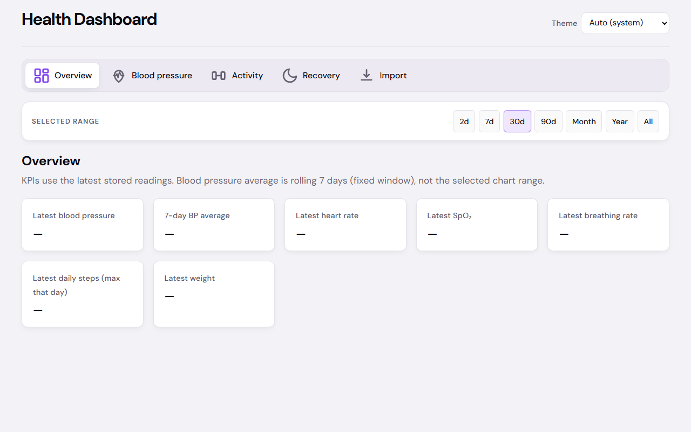
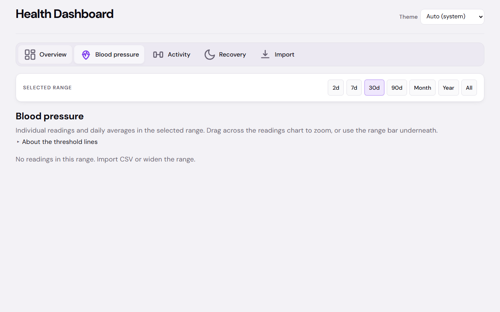
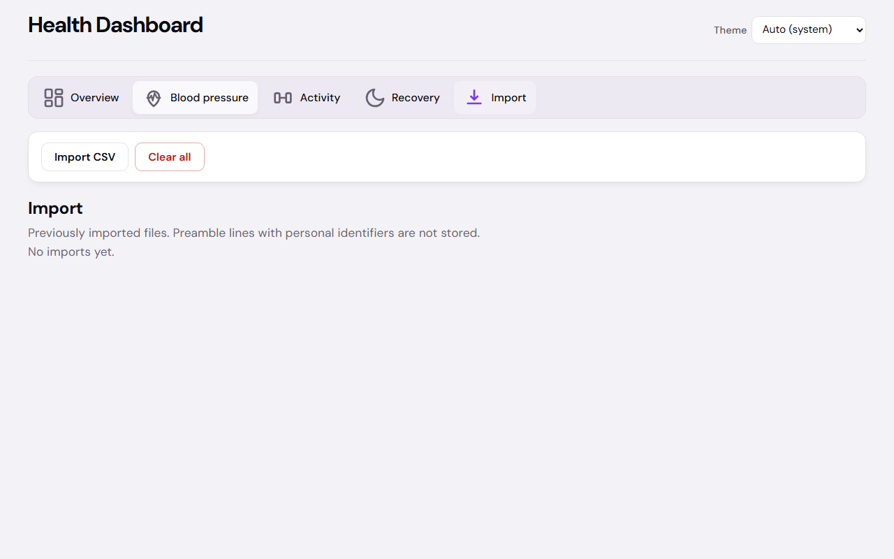

# Health data dashboard

Local-first React app for exploring health metrics (blood pressure, activity, sleep, etc.) from CSV exports. Data stays in the browser via IndexedDB.

## Screenshots

### Overview



### Blood pressure



### Import



To regenerate these images: start the dev server on `http://127.0.0.1:5173`, then run `node scripts/capture-readme-screenshots.mjs`.

## Prerequisites

- [Node.js](https://nodejs.org/) (LTS recommended)
- npm (bundled with Node)

## Run locally

From the project root:

```bash
npm install
npm run dev
```

Open the URL shown in the terminal (by default [http://localhost:5173](http://localhost:5173)).

## Other scripts

| Command | Description |
|--------|-------------|
| `npm run build` | Typecheck and produce a production build in `dist/` |
| `npm run preview` | Serve the production build locally (run `build` first) |
| `npm run lint` | Run ESLint |
| `npm run test` | Run Vitest once |
| `npm run test:watch` | Run Vitest in watch mode |
| `npm run test:e2e` | Run Playwright end-to-end tests (starts Vite on port 5173, or reuses an existing dev server when not in CI) |
| `npm run test:e2e:ui` | Run Playwright with the interactive UI |
| `npm run test:all` | Run Vitest, then Playwright |

### E2E tests (Playwright)

1. Install dependencies: `npm install`
2. If Playwright browsers are not installed yet: `npx playwright install` (on Linux CI, use `npx playwright install --with-deps`)
3. Run: `npm run test:e2e`

For debugging, use `npm run test:e2e:ui`. To run a single file: `npx playwright test e2e/smoke.spec.ts`.

## Stack

Vite, React, TypeScript, Dexie (IndexedDB), Recharts, Papa Parse for CSV.
